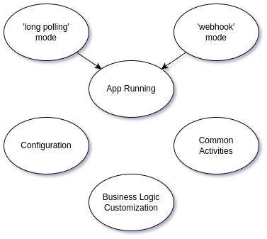

# repo-tmpl-tg-bot

The base npm package for building Telegram bots using [grammY](https://grammy.dev/)
and [@teqfw/di](https://github.com/teqfw/di).

## Overview

This package enables the creation of Telegram bots using the grammY
library.

It provides the following features:

* Loading the bot's configuration (the API access token) from external sources (e.g., JSON file).
* Running the Node.js application in two modes:
    * As a bot using long polling.
    * As a webhook server:
        * HTTP & HTTP/2 as an application server behind a proxy server.
        * HTTPS as a standalone server.
* Common activity (setup of commands on startup, webhook registration, etc.)
* Defining extension points where applications can add custom logic.



## Installation

Create the npm application and add the bot library to this app:

```shell
$ npm i @flancer32/repo-tmpl-tg-bot
```

## Usage

```
$ ./bin/tequila.mjs help
$ ./bin/tequila.mjs tg-bot-start        # long polling mode
$ ./bin/tequila.mjs tg-bot-stop
$ ./bin/tequila.mjs web-server-start    # webhook mode
$ ./bin/tequila.mjs web-server-stop
```

## Configuration

File `./cfg/local.json` of the main app:

```json
{
  "@flancer32/teq-telegram-bot": {
    "apiKeyTelegram": "..."
  }
}
```

## API

* Telegram_Bot_Back_Api_Setup: setup the grammY bot, add the commands and handlers.